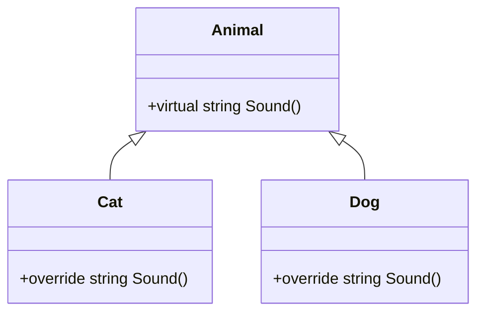

## UML

```mermaid
    classDiagram
    class Animal {
        +virtual string Sound()
    }

    class Cat {
        +override string Sound()
    }

    class Dog {
        +override string Sound()
    }
    
    Animal <|-- Cat
    Animal <|-- Dog
```